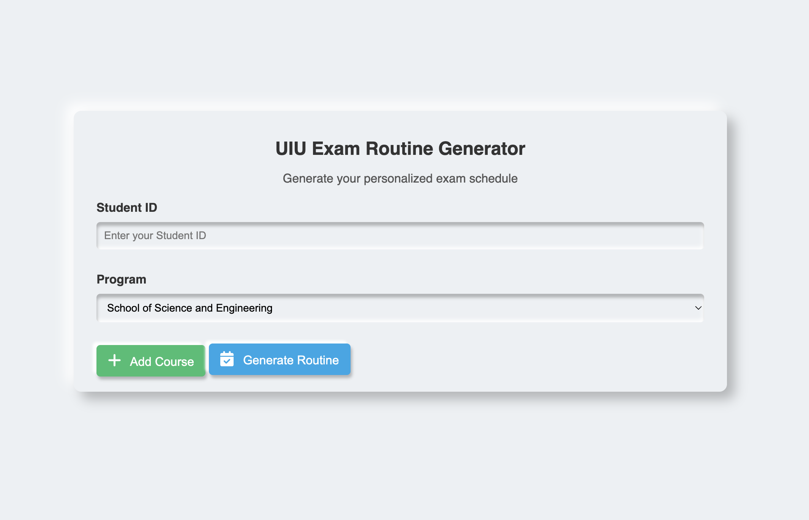
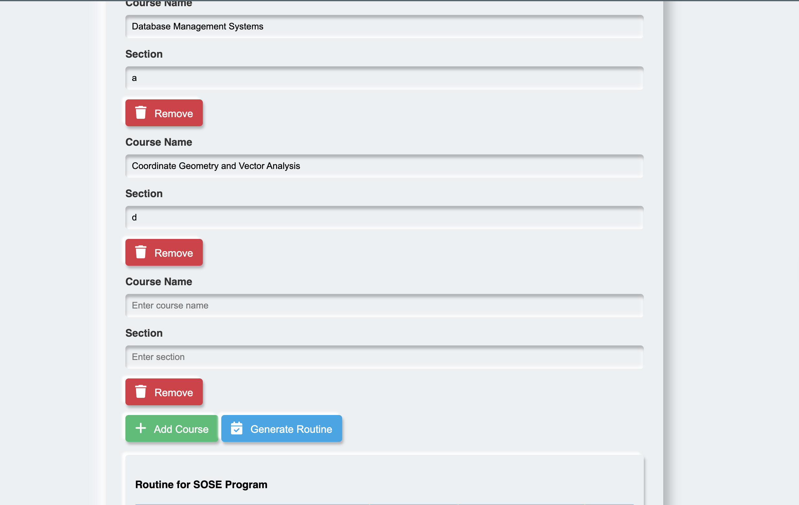
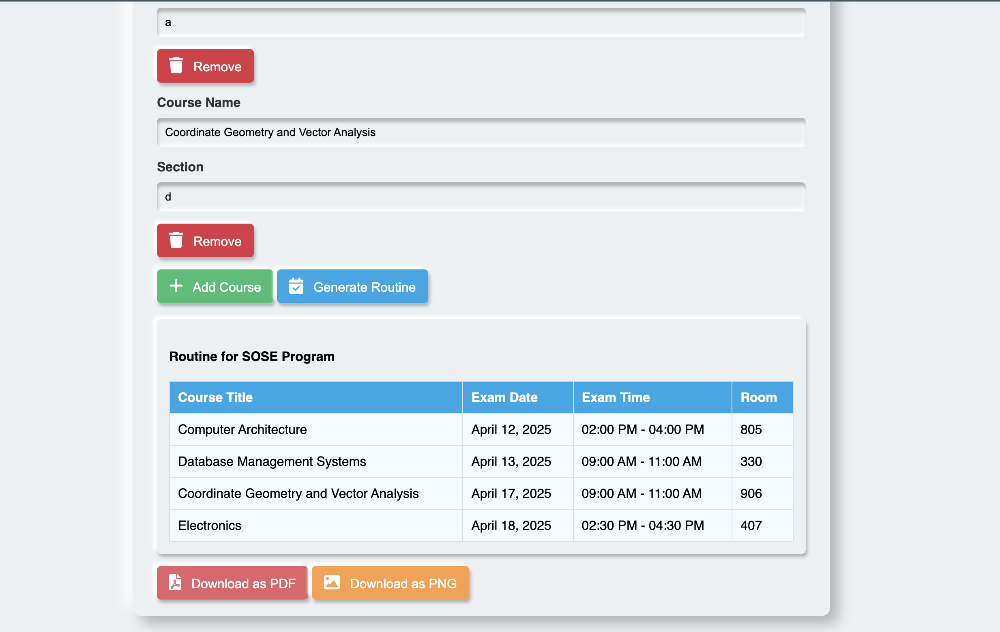

# Exam Routine Generator

## Purpose

In our university, it was hard to find exam room numbers by searching through huge Excel sheets or PDFs. The data was not user-friendly, and even Excel commands couldn't easily help us locate the right information. So, I created this application to make it easy for students to find their exam room numbers—no more hassle or confusion!

After making this application, I shared it with all of my friends. I quickly realized it was a real help for everyone, making the exam process smoother and less stressful.

---

## Screenshots

### App Start Screen



### Adding Courses and Sections



### Generated Routine Table



---

## Live Demo

Try the Exam Routine Generator online: [https://examroutine.vercel.app/](https://examroutine.vercel.app/)

---

## Project Overview

This is a **frontend-only web application** that helps UIU (United International University) students generate their personalized exam schedules and find their exam room numbers with ease. All logic runs in the browser—no backend or server is required. This design ensures the app can handle high traffic during exam times without any server bottlenecks.

---

## Why Frontend Only?

During exam periods, many students need to access their routines at the same time. To avoid server overload and ensure everyone can use the tool instantly, all data processing and logic are handled in the browser. The app fetches pre-generated JSON files and does not rely on any backend services.

---

## Data Preparation

- The original exam schedule data is provided as Excel files by the university.
- A Python script (see `sose_sobe_json_generator.ipynb`) is used **manually** to convert these Excel files into JSON format.
- The generated JSON files (`sose_output_file.json`, `sobe_output_file.json`, etc.) are included in the `client/` directory and loaded directly by the frontend.

---

## Project Structure

```
client/
├── index.html                # Main web page
├── script.js                 # All application logic (runs in browser)
├── styles.css                # Styling and responsive design
├── assets/                   # Images and original Excel files
├── sose_output_file.json     # Exam schedule data (SOSE)
├── sobe_output_file.json     # Exam schedule data (SOBE)
├── sose_all_course_titles.json # Course titles (SOSE)
├── sobe_all_course_titles.json # Course titles (SOBE)
├── sose_sobe_json_generator.ipynb # Python script for data conversion
└── ... (other supporting files)
```

---

## Features

- **No Backend Required:** 100% static, works directly in the browser.
- **Course Suggestions:** Autocomplete for course names based on department.
- **Routine Generation:** Personalized exam schedule based on student ID, department, courses, and sections.
- **Room Finder:** Instantly shows your exam room number based on your student ID.
- **Download:** Export your routine as PDF or PNG.
- **Responsive UI:** Modern, mobile-friendly design with animated loading screen.

---

## How It Works

1. **Data Loading:** The app loads JSON data files containing all exam schedules and course titles.
2. **User Input:** Students enter their Student ID, select their program, and add courses/sections.
3. **Routine Generation:** The app filters the JSON data in the browser to find matching exam dates, times, and room numbers for each course/section and the given student ID.
4. **Download:** Students can download their personalized routine as a PDF or PNG image.

---

## Usage

1. Open `index.html` in your browser (or visit the hosted site).
2. Enter your Student ID and select your program.
3. Add your courses and sections.
4. Click "Generate Routine" to see your personalized exam schedule and room numbers.
5. Download your routine as PDF or PNG if needed.

---

## Data & Scripts

- **Excel Files:** Located in `client/assets/` (original university data)
- **JSON Files:** Located in `client/` (used by the app)
- **Data Conversion Script:** `sose_sobe_json_generator.ipynb` (run manually to update JSON files)

---

## Author

- Asadullah Imran

---

## License

MIT (or specify your license)
